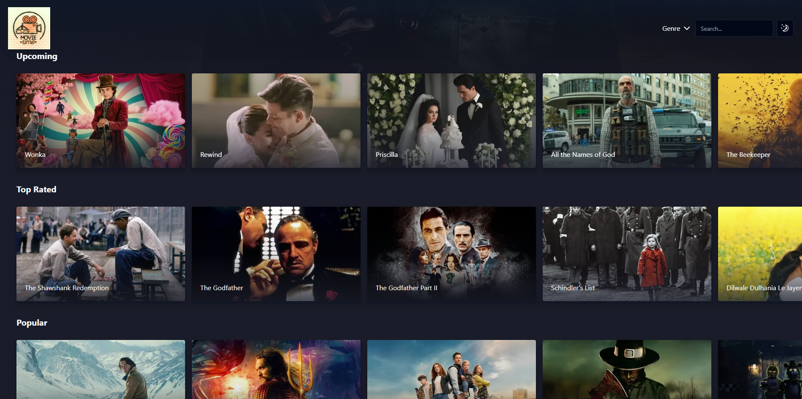
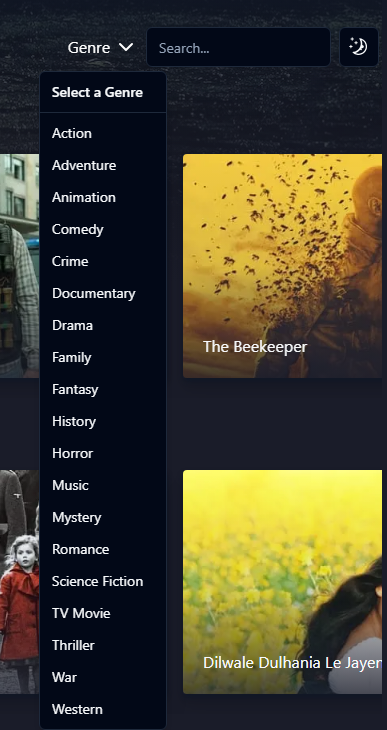
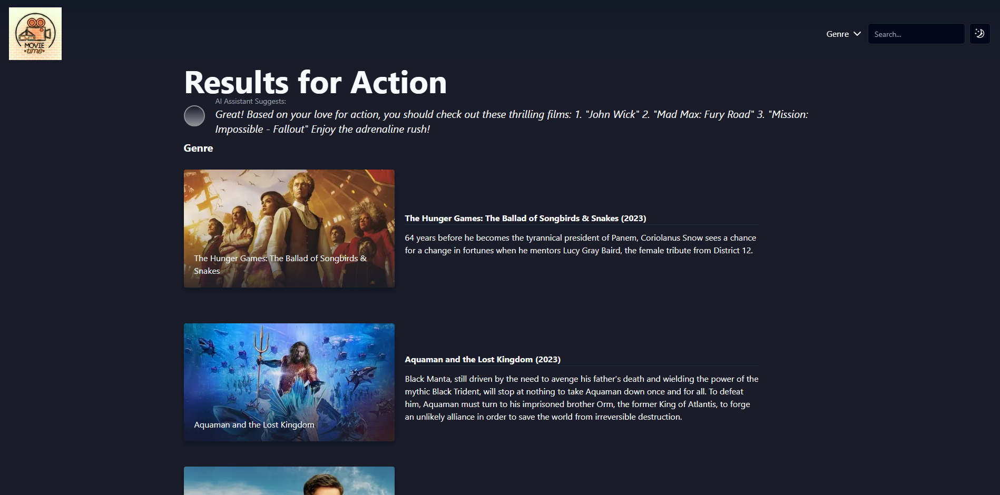
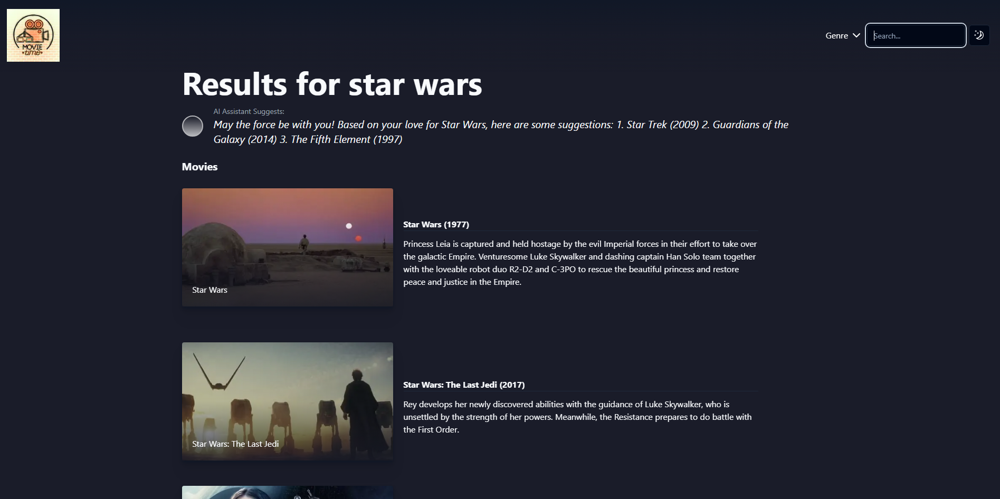

# Next.js Movies Platform

This is a Next.js application that leverages the TMDB API to retrieve movies based on genres and search terms. Additionally, it utilizes the OpenAI API to provide movie suggestions based on the search query.

## Features

### 1. Get Movies by Genre

The application allows users to browse movies based on different genres. Users can select a genre, and the app fetches and displays a list of movies associated with that genre.

### 2. Search Movies by Title

Users can search for movies using a search term. The app sends a request to the TMDB API to fetch relevant movies based on the user's input.

### 3. Movie Suggestions via OpenAI API

Upon entering a search term, the app sends a request to the OpenAI API to get movie suggestions related to the search query. These suggestions are then displayed to the user for a more personalized movie discovery experience.

## Getting Started

1. Clone the repository:

```bash
git clone https://github.com/Achraf-haddar/Movies-Platform.git
```

2. Install dependencies:

```bash
cd Movies-Platform
npm install
```

3. Set up environment variables:

   Create a .env.local file in the root of the project and add your TMDB API key and OpenAI API key (you can follow .env.local.example):

```bash
TMDB_API_KEY=your_tmdb_api_key
NEXT_PUBLIC_OPENAI_API_KEY=your_openai_api_key
```

4. Run the application:

```bash
npm run dev
```

5. Open the application:

   You can access the application in the browser via http://localhost:3000

## Technologies Used

- Next.js
- React.js
- Tailwind CSS
- Shadcn/ui

## Screenshots:









